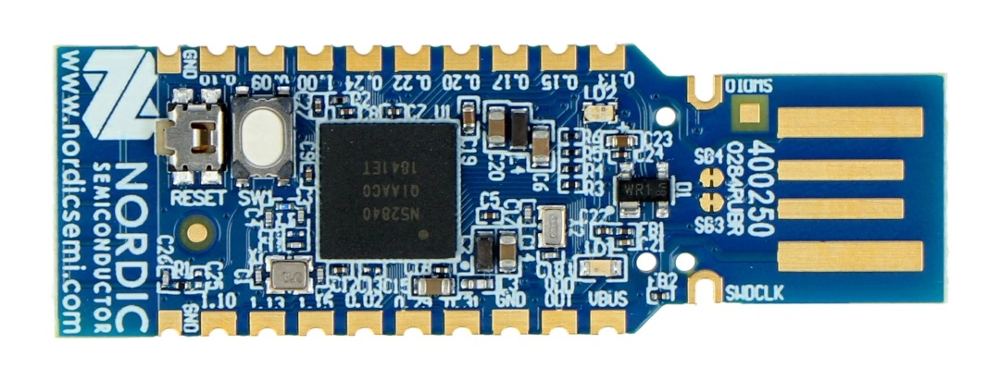

# NRF52840


You can use precompiled `NRF52840` application included in this directory to flash it with `nrfjprog` tool like below:

``` bash
$ nrfjprog -f NRF52 --program misc/nrf52840/nrf52840-hci-uart-app.hex –-chiperase --reset
```

After flashing it through the USB (shorter edge) you have to plug the cable to the other USB (long edge) and you should see the USB device name same as `CONFIG_USB_DEVICE_PRODUCT` variable.

**Enviromental Variables**
``` bash
# Export Baudrate (Precompiled example is using 1000000)
export BLUETOOTH_HCI_SOCKET_UART_BAUDRATE=1000000
# Export UART port (Linux or MAC) on Windows set to COMx
export BLUETOOTH_HCI_SOCKET_UART_PORT=/dev/tty.usbmodem...
```

This is Zephyr [`hci_uart` example](https://github.com/zephyrproject-rtos/zephyr/tree/main/samples/bluetooth/hci_uart) with the following configuration:

**samples/bluetooth/hci_uart/boards/nrf52840dk_nrf52840.conf**
``` 
CONFIG_USB_DEVICE_STACK=y
CONFIG_USB_DEVICE_PRODUCT="Zephyr HCI UART"
CONFIG_USB_CDC_ACM=y
CONFIG_USB_DEVICE_INITIALIZE_AT_BOOT=n

CONFIG_BT_MAX_CONN=5

CONFIG_USE_SEGGER_RTT=n
CONFIG_RTT_CONSOLE=n
CONFIG_LOG=n

CONFIG_BT_BUF_CMD_TX_COUNT=64
CONFIG_BT_BUF_ACL_RX_COUNT=64
CONFIG_BT_BUF_ACL_TX_COUNT=200
CONFIG_BT_BUF_EVT_RX_COUNT=255
CONFIG_BT_BUF_EVT_DISCARDABLE_SIZE=255

CONFIG_BT_BUF_ACL_RX_SIZE=255
CONFIG_BT_BUF_ACL_TX_SIZE=255
CONFIG_BT_BUF_CMD_TX_SIZE=255
CONFIG_BT_BUF_EVT_RX_SIZE=255

CONFIG_BT_CTLR=y
CONFIG_BT_CTLR_CRYPTO=y
CONFIG_BT_CTLR_LE_ENC=y
CONFIG_BT_CTLR_PRIVACY=y
CONFIG_BT_CTLR_FILTER_ACCEPT_LIST=y
CONFIG_BT_CTLR_DTM_HCI=y
CONFIG_BT_CTLR_ADVANCED_FEATURES=y
CONFIG_BT_CTLR_PARAM_CHECK=y
CONFIG_BT_CTLR_PROFILE_ISR=y

CONFIG_BT_DATA_LEN_UPDATE=y
```

**samples/bluetooth/hci_uart/boards/nrf52840dk_nrf52840.overlay**
``` 
/ {
	chosen {
		zephyr,bt-c2h-uart = &cdc_acm_uart0;
	};
};

&zephyr_udc0 {
	cdc_acm_uart0: cdc_acm_uart0 {
		compatible = "zephyr,cdc-acm-uart";
		label = "CDC_ACM_0";
		current-speed = <1000000>;
		hw-flow-control;
	};
};
```

**Build using `west` (Zephyr)**
``` bash
$ west build -p auto -b nrf52840dk_nrf52840 zephyr/samples/bluetooth/hci_uart
$ west flash
```

You can also use `NRF52` usb dongle like below with the same `hex` file.

# NRF52840 USB Dongle



The nRF52840 dongle comes preprogrammed with *Open DFU Bootloader*
and it can be programmed with nRF utilities: nRF Connect Desktop or `nrfutil`
CLI tool. This guide provides directions on programming the board using
`nrfutil`.
The application binary (`.hex` file) additionally has to be wrapped into a
special `.zip` package that can be understood by the DFU utilities.

## Using Precompiled Firmware

You can use precompiled `NRF52840 USB Dongle` application included in this directory to flash it with `nrfutil` tool like below:

``` bash
./nrfutil dfu serial -pkg misc/nrf52840/nrf52840-dongle-hci-uart-app.zip -p /dev/tty.usbmodem... -b 115200
```

## Building firmware for NRF52840 USB Dongle

Same Zephyr [`hci_uart` example](https://github.com/zephyrproject-rtos/zephyr/tree/main/samples/bluetooth/hci_uart) example is used for the dongle firmware with the samne configuration but **NO** `overlay` file as default `uart0` overlay for target `nrf52840dongle_nrf52840` is `USB CDC`.

**samples/bluetooth/hci_uart/boards/nrf52840dongle_nrf52840.conf**
``` 
CONFIG_USB_DEVICE_STACK=y
CONFIG_USB_DEVICE_PRODUCT="Zephyr HCI UART"
CONFIG_USB_CDC_ACM=y
CONFIG_USB_DEVICE_INITIALIZE_AT_BOOT=n

CONFIG_BT_MAX_CONN=5

CONFIG_USE_SEGGER_RTT=n
CONFIG_RTT_CONSOLE=n
CONFIG_LOG=n

CONFIG_BT_BUF_CMD_TX_COUNT=64
CONFIG_BT_BUF_ACL_RX_COUNT=64
CONFIG_BT_BUF_ACL_TX_COUNT=200
CONFIG_BT_BUF_EVT_RX_COUNT=255
CONFIG_BT_BUF_EVT_DISCARDABLE_SIZE=255

CONFIG_BT_BUF_ACL_RX_SIZE=255
CONFIG_BT_BUF_ACL_TX_SIZE=255
CONFIG_BT_BUF_CMD_TX_SIZE=255
CONFIG_BT_BUF_EVT_RX_SIZE=255

CONFIG_BT_CTLR=y
CONFIG_BT_CTLR_CRYPTO=y
CONFIG_BT_CTLR_LE_ENC=y
CONFIG_BT_CTLR_PRIVACY=y
CONFIG_BT_CTLR_FILTER_ACCEPT_LIST=y
CONFIG_BT_CTLR_DTM_HCI=y
CONFIG_BT_CTLR_ADVANCED_FEATURES=y
CONFIG_BT_CTLR_PARAM_CHECK=y
CONFIG_BT_CTLR_PROFILE_ISR=y

CONFIG_BT_DATA_LEN_UPDATE=y
```

**Build using `west` (Zephyr)**
``` bash
$ west build -p auto -b nrf52840dongle_nrf52840 zephyr/samples/bluetooth/hci_uart
$ west flash
```

### Installing nrfutil

Download latest `nrfutil` from [the official website](https://www.nordicsemi.com/Products/Development-tools/nrf-util):

``` bash
curl -L -o nrfutil https://developer.nordicsemi.com/.pc-tools/nrfutil/x64-linux/nrfutil
chmod +x nrfutil
```

You need to additionally install specific 'plugins' to `nrfutil` so that
the packaging and programming commands are actually available:

``` bash
./nrfutil install nrf5sdk-tools
./nrfutil install device
```

### Packaging the application

You need to run `nrfutil pkg genarate` command with a few mandatory parameters
to package the application binary:

* `--hw-version` - microcontroller family - `--hw-version 52`
  indicates that nRF52 microcontroller is used.
* `--sd-req` - required version of *SoftDevice*. This parameter is mandatory
  but is not relevant for applications using Zephyr's LL controller. It can
  be set, for example to `--sd-req 0x00`.
* `--application-version` is the version of the application inside the
  package. It is required but can be also arbitraily set, for example to `1`.
* `--application` is the path to application binary.


You will need also to specify the output file as a positional argument.

The full command will look like this:

``` bash
./nrfutil pkg generate \
    --hw-version 52 --sd-req 0x00 \
    --application-version 1 \
    --application <path_to_application_binary>.hex nrf52840-dongle-hci-uart-app.zip
```

### Programming the dongle

The package is finally ready for the firmware update over serial.
The dongle needs to be put into bootloader mode by pressing the `RESET`
button on the PCB (the angled one). The on-board LED should start "breathing".
The board should enumerate as "Open DFU Bootloader" in your system and is
ready for update over serial.

You will need to provide the following arguments to the update command:

- `-pkg` - application package.
- `-p` - serial port of the device.
- `-b` - baud rate.

The full commmand will look like this:

``` bash
./nrfutil dfu serial -pkg nrf52840-dongle-hci-uart-app.zip -p /dev/tty.usbmodem... -b 115200
```
